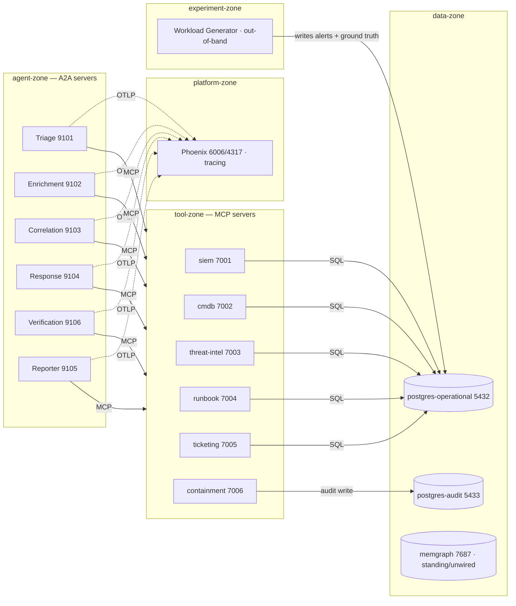
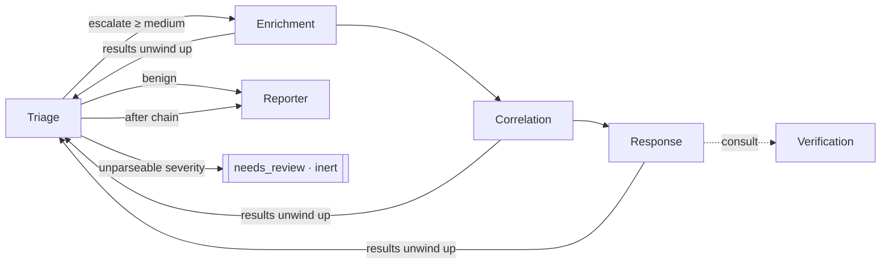

# SOC Multi-Agent Protocol Testbed

A synthetic **Security Operations Center (SOC)** run by a team of LLM agents, built
to measure the **security ⇄ efficiency trade-off** of agent-interaction protocols
(**MCP**, **A2A**, and later **ANP**) in a multi-agent system. This is the codebase
for a Master's thesis.

The guiding design principle: **the protocol machinery is real, the domain logic is
synthetic.** Agents talk to each other over real A2A, call real MCP tools over
streamable HTTP, and are traced end-to-end with OpenTelemetry — but the "threat
intel", "CMDB", "containment", etc. behind those tools are deliberately stubbed and
seeded with synthetic data. The thesis measures the *protocol layer*, not a real SOC.

---

## Table of contents
1. [What the system does](#what-the-system-does)
2. [Architecture](#architecture)
3. [Repository layout](#repository-layout)
4. [Prerequisites](#prerequisites)
5. [Quick start (Docker Compose)](#quick-start-docker-compose)
6. [Driving the pipeline](#driving-the-pipeline)
7. [The Workload Generator & ground truth](#the-workload-generator--ground-truth)
8. [Inspecting the system](#inspecting-the-system)
9. [Verification scripts](#verification-scripts)
10. [Configuration reference](#configuration-reference)
11. [Kubernetes deployment (Kustomize)](#kubernetes-deployment-kustomize)
12. [Key concepts](#key-concepts)
13. [Known limitations](#known-limitations)

---

## What the system does

An **alert** (e.g. "host X is transferring gigabytes to a known-bad IP") enters at the
**Triage** agent. Triage classifies its severity; a **declarative workflow** then routes
it. High-severity alerts run a genuine depth-4 delegation chain
(triage → enrichment → correlation → response, with response consulting verification)
and end in a filed incident. Low-severity alerts short-circuit to a dismissal report.
Alerts the classifier can't parse land in an inert **needs-review** terminal — never
silently escalated or dropped.

Every agent runs the same loop: observe → think (LLM) → act (call MCP tools / delegate
over A2A) → repeat until it produces an answer. The whole run is one connected trace in
Phoenix.

---

## Architecture

Five logical **zones** (mirrored as Kubernetes namespaces):



**Delegation graph** (`workflows/phishing_triage.yaml` — this file *is* the topology):



- **Agents** share one image (`soc-agent:dev`) and one base module
  (`services/soc_agent/__init__.py`); they differ only in system prompt, tools, and
  Agent Card. Routing is deterministic and data-driven (the `WorkflowExecutor`), not
  decided by the LLM.
- **Tools** share one image (`soc-tool:dev`). Each exposes a real MCP interface over a
  **data-access seam** to Postgres.
- **Inference** is any OpenAI-compatible endpoint (`INFERENCE_ENDPOINT`): host Ollama
  (`llama3.1:8b`) in dev, vLLM downstream — no code change.

---

## Repository layout

```
services/
  soc_agent/__init__.py        shared agent base: LLM↔tool loop, A2A lifecycle, tracing, WorkflowExecutor
  <name>-agent/server.py       the 6 agents (triage, enrichment, correlation, response, reporter, verification)
  mcp-<name>/server.py         the 6 MCP tools (siem, cmdb, threat-intel, runbook, ticketing, containment)
  mcp_db.py                    tiny shared Postgres helper (rows/execute) used by the tool seams
  workload-generator/generator.py   out-of-band labeled-alert generator (+ ground truth)
workflows/phishing_triage.yaml the declarative delegation graph (topology + branch threshold)
docker/
  Dockerfile.agent, Dockerfile.tool     the two shared images
  requirements-agent.txt, requirements-tool.txt
  initdb/operational/*.sql     operational schema + seed + agent-invisible ground-truth table
  initdb/audit/*.sql           append-only audit schema
compose.yaml                   the full 16-service local stack
scripts/                       verification + inspection helpers (see §9)
deployment/                    Kustomize base + overlays/minimal + network-policy component (see §11)
```

---

## Prerequisites

- **Docker** + Docker Compose v2.
- **Ollama** running on the host with the dev model pulled:
  ```bash
  ollama serve
  ollama pull llama3.1:8b
  ```
  Containers reach it at `http://host.docker.internal:11434/v1`.
- **Python** for the host-side scripts — use the project's existing conda env
  (do **not** create a repo `.venv`):
  ```bash
  /opt/miniconda3/envs/masterarbeit/bin/python --version
  ```
  It provides `a2a-sdk`, `mcp`, `httpx`. (Postgres inspection uses `psql` inside the
  containers, so the host needs no DB driver.)

---

## Quick start (Docker Compose)

```bash
docker compose up --build
```

This builds the two shared images once (`triage-agent` builds `soc-agent:dev`,
`mcp-siem` builds `soc-tool:dev`; the rest reference the tags) and starts 16 services:
6 agents, 6 tools, both Postgres instances, Memgraph, and Phoenix. Check health:

```bash
docker compose ps
```

All should be `healthy` (Memgraph has no healthcheck; it's standing/unwired by design).
Open Phoenix at **http://localhost:6006**.

The **Workload Generator** is profile-gated (it doesn't auto-run):

```bash
docker compose --profile workload up workload-generator   # or `docker compose run` (below)
```

Tear down (add `-v` to also wipe the DB volumes and re-seed on next up):

```bash
docker compose down          # keep data
docker compose down -v       # reset databases
```

---

## Driving the pipeline

The recommended way to push alerts through the live system is the **Workload
Generator + driver** (next section), which is verified against the containerized stack.

> **Note on A2A card resolution:** agents advertise their *container* hostname in their
> Agent Card (e.g. `http://triage-agent:9101/`), which a host process cannot resolve.
> `scripts/run_workload.py` handles this by rewriting the resolved card to the
> host-mapped port. Scripts that resolve a card and are run from the host against the
> container stack need the same treatment or must run **on the `soc` network**.

---

## The Workload Generator & ground truth

The generator is **out-of-band**: not an agent, no protocol overhead — it simply
`INSERT`s alerts into the operational DB, which the SIEM tool then serves. Crucially it
records each alert's **true class** in a separate, **agent-invisible** ground-truth
table (`alert_ground_truth`) keyed by alert id, so evaluation can score agent outcomes
against truth without the agents ever seeing the answer key.

**Preview a run without touching the DB** (deterministic — same seed ⇒ same sequence):

```bash
docker compose run --rm workload-generator plan --seed 1337 --count 20
```

**Insert a workload** and capture the operator manifest (one JSON line per alert):

```bash
docker compose run --rm -T -e WORKLOAD_RATE=5 workload-generator run --seed 1337 --count 20 > /tmp/wl.jsonl
```

**Drive it through the live pipeline** and see which path each alert took (from real
content, not the hidden label):

```bash
/opt/miniconda3/envs/masterarbeit/bin/python scripts/run_workload.py --manifest /tmp/wl.jsonl --concurrency 3
```

Output ends with a per-alert table (`truth=… path=escalate|benign|needs_review
disposition=incident|dismissed`) and a "both paths occurred" check.

Each generated alert is **seed-linked**: its destination is a real indicator in the
`iocs` table and its source is a real asset in `assets`, so enrichment/correlation
lookups resolve. Benign alerts reference *clean* indicators and escalate alerts
*malicious/suspicious* ones — distinguishable only by looking them up. Configure via
`WORKLOAD_*` env or CLI flags (see §10).

---

## Inspecting the system

### Tracing (Phoenix)
Open **http://localhost:6006** → project `soc-testbed`. Each workflow run is one
connected trace; span kinds `AGENT` (per-agent task), `CHAIN` (delegation), and `LLM`
(auto-instrumented, with prompts/tokens) nest under the entry. A CLI tree of the latest
escalate trace:

```bash
/opt/miniconda3/envs/masterarbeit/bin/python scripts/phoenix_trace.py
```

### Operational database (alerts, assets, IOCs, incidents, ground truth)
```bash
docker compose exec postgres-operational psql -U soc -d soc_operational -c "\dt"
docker compose exec postgres-operational psql -U soc -d soc_operational -c \
  "SELECT id, source_ip, dest_ip, rule_name FROM alerts ORDER BY ts DESC LIMIT 5;"
# Ground truth (the evaluation join) — NOT visible to any agent:
docker compose exec postgres-operational psql -U soc -d soc_operational -c \
  "SELECT alert_id, true_class, indicator_verdict FROM alert_ground_truth LIMIT 10;"
# Incidents filed by the Reporter agent:
docker compose exec postgres-operational psql -U soc -d soc_operational -c \
  "SELECT incident_id, status, severity, title FROM incidents ORDER BY created_at DESC;"
```

### Audit database (separate instance, append-only)
```bash
docker compose exec postgres-audit psql -U audit_admin -d soc_audit -p 5433 -c \
  "SELECT audit_id, tool, target, action, actor FROM audit_log ORDER BY recorded_at DESC;"
```
The containment tool holds **only** the audit DSN, so it structurally cannot reach
operational data. Confirm the instances are truly separate — the operational DB has no
`audit_log`, the audit DB has no `alerts`.

### Verify ground truth is agent-invisible
The SIEM tool returns only `{id, timestamp, source_ip, dest_ip, rule_name, description}`
— no `true_class`, no `severity`. No MCP tool queries `alert_ground_truth`.

---

## Verification scripts

Run with the conda Python. They read endpoints from env (localhost / mapped-port
defaults). The A2A-card-based ones (all except `verify_tools`) carry the card-resolution
caveat noted in §6 when run from the host against the container stack.

| Script | What it checks |
|---|---|
| `verify_tools.py` | Each MCP tool responds and returns real data through its seam. |
| `verify_agents.py` | Each agent serves its Agent Card and runs its LLM↔tool loop. |
| `verify_slice.py` | End-to-end vertical slice: a task grounds in SIEM-only facts that can only appear via a second LLM call (proves the loop closed). |
| `verify_workflow.py` | Routing: one escalate + one benign alert take the correct branches. |
| `verify_references.py` | Rebuilds the parent→child delegation tree purely from A2A task references (RQ: delegation depth). |
| `verify_response.py` | Response's gated containment: approves a workstation, rejects a domain controller. |
| `run_workload.py` | Drives a generated workload through the live pipeline (§7). |
| `phoenix_trace.py` | Prints the latest escalate trace as a nested tree with latencies/tokens. |

---

## Configuration reference

Everything is env-driven (no hardcoded localhost survives into the container network).

**Agents** (`services/soc_agent`): `INFERENCE_ENDPOINT`, `INFERENCE_MODEL`,
`INFERENCE_TIMEOUT`, `MAX_TOOL_ITERATIONS`, `A2A_LISTEN_HOST/PORT`, `A2A_PUBLIC_URL`,
`OTEL_EXPORTER_OTLP_ENDPOINT`, `PHOENIX_PROJECT_NAME`, `<PEER>_A2A_ENDPOINT` (×6),
`<TOOL>_MCP_ENDPOINT` (×6), `WORKFLOW_DEF`.

**Tools**: `MCP_LISTEN_HOST/PORT`, `OPERATIONAL_DB_URL` (5 tools) or `AUDIT_DB_URL`
(containment only).

**Workload Generator**: `WORKLOAD_RATE` (alerts/sec), `WORKLOAD_ARRIVAL`
(`steady|poisson`), `WORKLOAD_MIX` (`benign:0.6,escalate:0.3,campaign:0.1`),
`WORKLOAD_SEED`, `WORKLOAD_COUNT` and/or `WORKLOAD_DURATION`, `WORKLOAD_CAMPAIGN_SIZE`,
`WORKLOAD_RUN_ID`, `OPERATIONAL_DB_URL`.

---

## Kubernetes deployment (Kustomize)

`deployment/` translates the compose system to Kubernetes. **Currently implemented:
the shared `base` and the `minimal` overlay** (the reportable 5-zone tier and scaled
overlay come later).

- **base** — full 5-zone topology (agent / tool / platform / data / experiment), every
  workload at replica 1, faithful to the running system.
- **overlays/minimal** — dev tier; folds the data zone into platform-zone (4 zones).
  This structural deviation is *why minimal is non-reportable*, and it's spelled out
  patch-by-patch in the overlay.

**Render & validate** (no cluster needed). The init SQL is single-sourced from
`docker/initdb/`, so relax the load restrictor:

```bash
kubectl kustomize --load-restrictor LoadRestrictionsNone deployment/base
kubectl kustomize --load-restrictor LoadRestrictionsNone deployment/overlays/minimal
kubectl kustomize --load-restrictor LoadRestrictionsNone deployment/overlays/reportable
```

Overlays: **`minimal`** (4-zone dev, no policies) and **`reportable`** (5-zone +
NetworkPolicies on); `scaled` comes later. Full per-cluster deploy steps are in
`deployment/CLUSTER_BOOTSTRAP_minimal.md` / `_reportable.md`.

### Building & pushing the two images (for the cluster)

The agents and tools run from two **private** GHCR images built from this repo.
Rebuild + push whenever the code they bake in changes (agent = `services/soc_agent`
+ agents/workflows; tool = `services/mcp-*` + `mcp_db.py` + generator). **Build for
`linux/amd64`** — a native build on an arm64 Mac won't run on the cluster.

```bash
# authenticate (GitHub PAT with write:packages)
echo "$GHCR_PAT" | docker login ghcr.io -u thehappyson --password-stdin

# tag by commit SHA for provenance, build amd64, push
TAG=$(git rev-parse --short=12 HEAD); echo "TAG=$TAG"
docker buildx build --platform linux/amd64 -f docker/Dockerfile.agent -t ghcr.io/thehappyson/soc-agent:$TAG --push .
docker buildx build --platform linux/amd64 -f docker/Dockerfile.tool  -t ghcr.io/thehappyson/soc-tool:$TAG  --push .
```

Then bump both `newTag`s in `deployment/base/kustomization.yaml` to `$TAG`, re-apply
the overlay, and `kubectl -n agent-zone rollout restart deployment` (and
`-n tool-zone` if the tool image changed). Commit before building so the SHA tag
matches the code in the image.

> `kubectl apply --dry-run=client` needs a reachable API server for discovery, so it
> can't validate fully offline; the render above plus structural checks are the offline
> equivalent. **Do not apply to a real cluster from this repo yet.**

**Networking is OPEN BY DEFAULT** — base contains *no* restrictive NetworkPolicies, so
agents can *attempt* cross-zone access and the protocol layer is the control being
measured. Restrictive policies are an **opt-in Kustomize component**
(`deployment/components/network-policies/`) added only in the reportable tier.

**Placeholders to fill before deploying** (grep `REPLACE_ME` / `TODO`): the two image
registries (`REPLACE_ME/soc-agent`, `REPLACE_ME/soc-tool`) and tags; `INFERENCE_ENDPOINT`
(no host-gateway in k8s); `storageClassName` for the Postgres PVCs; DB credentials
(dev `soc/soc` — move to a Secret); resource requests/limits (unprofiled).

> **Pre-flight for the reportable tier:** verify the target cluster's CNI **enforces
> NetworkPolicy** — Calico and Cilium do; plain flannel/kubenet do not. The
> network-policy component documents the verification recipe. This is currently
> **unverified** (no cluster) and is a required gate before the reportable tier.

---

## Key concepts

- **Protocol real, domain stubbed.** The A2A/MCP/OTel machinery is genuine; the SOC
  data is synthetic and seeded. The thesis measures the protocols.
- **Data-access seam.** Each tool method calls one internal `_fetch/_lookup/_write`
  function — the single place canned data was swapped for real Postgres. Seam
  signatures and return shapes are stable by contract.
- **Declarative workflow.** `workflows/phishing_triage.yaml` is the topology; agents
  resolve successors from it at runtime. Re-wire the graph by editing that one file.
- **Deterministic routing + `needs_review`.** Routing is not left to the LLM; an
  unparseable severity terminates in an inert, logged review state (neither escalate
  nor dismiss).
- **Agent-invisible ground truth.** True classes live in a separate table no tool
  queries; evaluation joins by alert id.
- **Operational/audit separation.** Two Postgres instances; containment writes only to
  the append-only audit DB.

---

## Known limitations

- **Small-model tool-calling.** With `llama3.1:8b` the Response agent often *narrates*
  containment without invoking the tool, so the escalate path may not produce an
  in-workflow audit write. The audit-write seam itself is proven by direct call; this
  improves with the downstream reasoning model.
- **Host ↔ container A2A cards.** See §6 — drive on-network or use the card-rewrite
  pattern in `run_workload.py`.
- **Phoenix client dependencies.** The full `arize-phoenix` *server* pins `mcp<2` and is
  kept out of the agent image (only `arize-phoenix-otel`); Phoenix runs as its own
  container. `scripts/phoenix_trace.py` needs the Phoenix client available in whatever
  Python runs it.
- **Kubernetes** is at base + minimal only; reportable/scaled tiers and the CNI check
  are pending.
